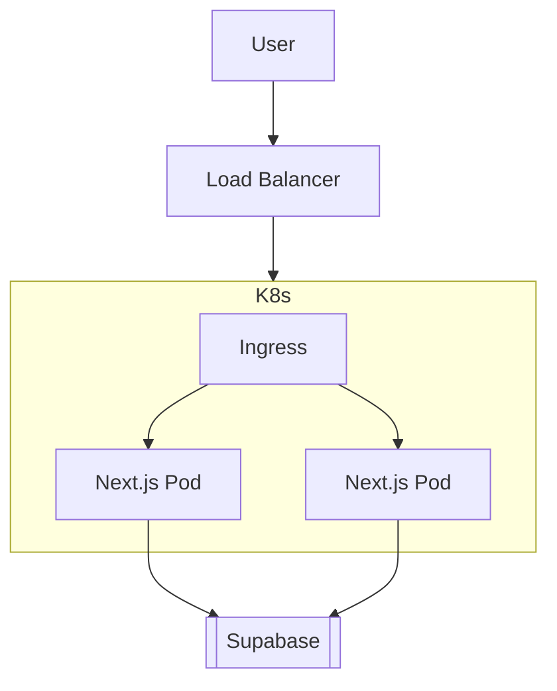

# Kubernetes Implementation

This note tracks the technical transition from single-server deployment to a managed K8s cluster.

## Why Kubernetes?
We move to Kubernetes to achieve:
1. **High Availability**: Redundant instances across servers.
2. **Self-Healing**: Automatic restarts of failing pods.
3. **Elasticity**: Scaling up for lunch/dinner spikes.

## Prerequisites
- [x] Create production [[Docker Guide|Dockerfile]]
- [ ] Set up Private Container Registry (GHCR/ECR)
- [ ] Configure GitHub Actions to push images

## Implementation Phasing
1. **Phase 1**: Wrap Next.js in Docker.
2. **Phase 2**: Deploy to a "Serverless Container" host like Cloud Run.
3. **Phase 3**: Migrate to a Managed K8s Cluster (GKE/EKS/DOKS).

## Architecture Diagram

---
#tags/kubernetes #scaling #devops
