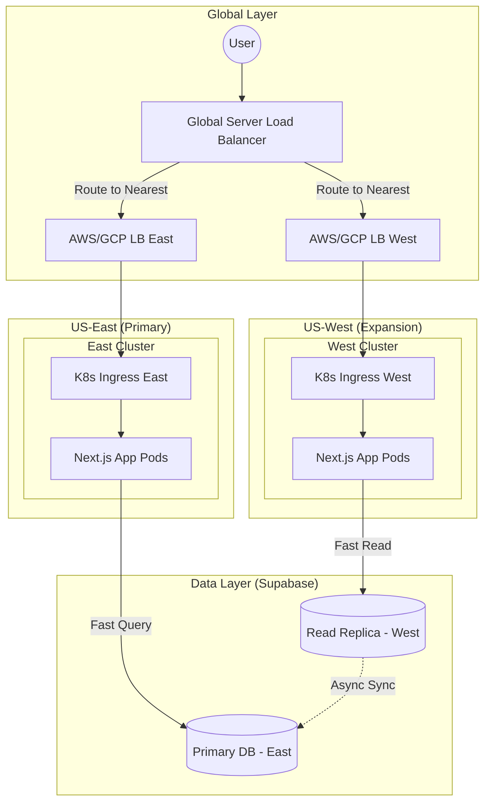

# Multi-Region Kubernetes Expansion (Country Wide)

As we expand from the East Coast to the **West Coast**, our infrastructure must evolve from a single-region setup to a **Multi-Region Global Architecture**. This ensures low latency for users in California/Oregon and provides high-availability if one region goes down.

## 🗺️ Multi-Region Architecture Diagram

---

## 🚀 Implementation Plan for West Coast Expansion

### 1. Global Traffic Routing
We will implement **Global Server Load Balancing (GSLB)** (via Cloudflare or AWS Global Accelerator). 
- **User Experience**: A user in Seattle will be routed to the `US-West` cluster, while a user in NYC goes to `US-East`.
- **Latency**: Reduces network round-trip time by 60-100ms for West Coast users.

### 2. Multi-Cluster Management
Instead of one massive cluster, we will run **independent sibling clusters**.
- **Action**: Use **Terraform** or **Pulumi** to "clone" our East Coast Kubernetes configuration to a new region in the West (e.g., `us-west-2`).
- **Sync**: Use a tool like **ArgoCD** to ensure that when we push code, both the East and West clusters update simultaneously.

### 3. Data Strategy (The "Supabase" Challenge)
Database latency is the biggest hurdle for multi-region apps.
- **Problem**: If the app is in the West but the DB is in the East, every database call takes ~80ms.
- **Solution**: Upgrade Supabase to a tier that supports **Read Replicas**.
    - Place a Read Replica in the West for fast dashboard loading.
    - Writes (orders/signups) still go to the East Primary but are as fast as possible due to optimized backbone networking.

### 4. Infrastructure Impact
- **Cost**: Expansion roughly doubles the monthly cost of the compute layer (Kubernetes nodes).
- **Deployment**: We must now monitor two healthy clusters instead of one.
- **Resiliency**: If `US-East` has a major outage, the Global LB will automatically reroute *all* traffic to the West Coast, keeping TrueServe online.

---
#tags/kubernetes #multi-region #expansion #west-coast
